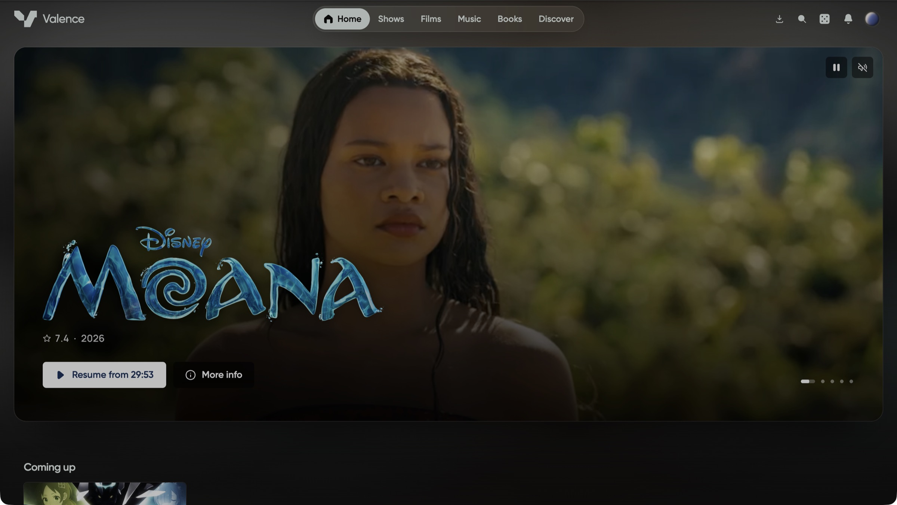

<div align="center">
<br/>
<br/>


# Valence

**A self hosted streaming platform for your own library.**

Your films, programmes, music and books, on every screen in the house, from a server you own.

[](https://github.com/ValenceOSS/Valence/actions/workflows/ci.yml)
[](https://github.com/ValenceOSS/Valence/releases)
[](https://github.com/MarquesCoding/Valence/pkgs/container/valence)
[](LICENSE.md)
[](https://github.com/ValenceOSS/Valence/stargazers)

[Website](https://getvalence.app) · [Documentation](https://docs.getvalence.app) · [Changelog](https://getvalence.app/changelog) · [Plugins](https://getvalence.app/plugins)

</div>

<div align="center">



</div>

## What it does

**Watch**

- **Plays what you already have.** Point it at a folder. It reads what is there, finds the artwork
  and the details, and leaves your files exactly as it found them. Your media is mounted read only.
- **Streams to anything.** Direct play where the device can take the file, and a transcode where it
  cannot, negotiated per device rather than per server. HDR stays HDR, and tone mapping happens
  only because a screen needs it.
- **Ready before you press play.** Copies a slow connection or an old device will need can be made
  ahead of time, overnight, and kept beside the original.
- **Skips the intro.** Intros, recaps and credits are found on their own, so each can be skipped
  with one press.
- **Collections.** Group films and programmes the way you think of them, and they show up as
  shelves on every client.

**Listen and read**

- **Music** with albums, artists, playlists, liked songs, lyrics and a queue.
- **Books and audiobooks**, read in the browser or on a phone, or listened to with chapters, speed
  and a sleep timer.

**Everybody in the house**

- **A household, not a single account.** Everybody gets a face, their own continue watching,
  favourites, ratings and history. Sign in by username, email or a passkey, with two-step sign-in.
- **Accounts without handing out passwords.** Add somebody by name and give them a single-use setup
  link or QR code, so they choose their own password. Password resets and setup links can be
  emailed through any SMTP provider.
- **The right things for the right people.** Roles, per-person library access, and age limits with
  exceptions.
- **Watch and listen together.** A party keeps everybody at the same moment in the same film, or the
  same song, with the picture staying in step rather than drifting.
- **Share a link.** One title or one series, to somebody with no account, for as long as you decide.

**Getting things**

- **Ask for what is missing.** Requests for films, programmes, music and books, with approval,
  quality profiles and download clients built in.
- **Or keep the setup you have.** Hand requests to Radarr, Sonarr or Lidarr, sync indexers from
  Prowlarr, and let Overseerr or Jellyseerr send their requests straight in.

**Moving in**

- **Bring everything across** from Jellyfin, Emby or Plex during setup: accounts, watch history,
  favourites, ratings, playlists, collections, access and intro markers, along with your Radarr,
  Sonarr, Prowlarr and Seerr setup. It only ever reads from the old server.

**Make it yours**

- **Plugins and themes** from a signed catalogue, each running in its own sandbox.
- **23 languages**, every word of every client read from one strings file.
- **An API you can build on.** Every endpoint has a contract, and the reference is generated from it
  and served by the server itself. Webhooks tell other things what happened.

## Every screen

| Client     | Runs on                          | What it has                                                        |
| ---------- | -------------------------------- | ------------------------------------------------------------------ |
| Web        | Any browser                      | Everything, including the admin area. Installs as an app.          |
| Desktop    | Electron                         | The web client in its own window, with Discord presence            |
| Phone      | iPhone and Android, with CarPlay | Downloads for offline, AirPlay, signing a television in by QR code |
| Television | Apple TV                         | A ten-foot interface for the remote, signed in from a phone        |

## Run it

The image carries the server, the web client and the media service.

```bash
curl -O https://raw.githubusercontent.com/ValenceOSS/Valence/main/compose.yaml
docker compose up -d
```

Then open `http://localhost:8420` and follow the setup. It walks you through your account, your
household and your libraries, and offers to import everything from Jellyfin, Emby or Plex.

- **Your media:** edit the mount in `compose.yaml`. It is mounted read only, deliberately.
- **Requests:** start the stack with `docker compose --profile requests up -d` to run the requests
  service beside it.
- **Database:** Postgres by default. MySQL 8.0.21+ and MariaDB 10.6+ work too; see
  `compose.mysql.yaml` and `compose.mariadb.yaml`.

[`DEPLOYMENT.md`](DEPLOYMENT.md) covers settings, a reverse proxy, hardware transcoding and
upgrades. The full documentation, with install guides, a guide to every screen, developer
documentation and the interactive API reference, is at
[docs.getvalence.app](https://docs.getvalence.app).

## Develop it

```bash
pnpm install
docker compose -f compose.dev.yaml up -d db
pnpm ffmpeg:sync
pnpm dev
```

| Surface          | Address                                |
| ---------------- | -------------------------------------- |
| Web client       | http://localhost:5173                  |
| API              | http://localhost:8420/api              |
| API reference    | http://localhost:8420/api/reference    |
| OpenAPI document | http://localhost:8420/api/openapi.json |
| Requests service | http://localhost:8421                  |

`pnpm ffmpeg:sync` fetches the FFmpeg build Valence ships with. Skipping it works but quietly costs
you hardware encoding and HDR handling, because the FFmpeg on your machine is unlikely to be the
one Valence was built against.

The documentation site runs locally with `pnpm --filter @valence/docs spec` followed by
`pnpm --filter @valence/docs dev`.

## Layout

```
apps/
  web/          Vite and React, the browser client
  desktop/      Electron, a window onto a server
  mobile/       Expo and React Native, the phone client
  tv/           Expo and React Native for tvOS, the television client
  server/       Hono, the API contract, the plugin broker, the jobs
  requests/     Hono, requests, indexers and download clients
  transcoder/   Rust, the media service
  landing/      Vite and React, getvalence.app
  docs/         Vite and React, docs.getvalence.app
packages/
  contracts/    Zod schemas to OpenAPI. The source of truth.
  core/         Shared logic, playback negotiation
  database/     Postgres, MySQL and MariaDB, one schema in each dialect
  client/       What Valence is: readers, queries, realtime, sessions
  screens/      What Valence looks like: every web screen and its route
  native/       What the phone and the television share
  ui/           ValenceUI: Radix, Tailwind, Keyline icons, Motion
  i18n/         Every word, in every language
  plugin-sdk/   The public plugin API
```

## Commands

```bash
pnpm test         # every package
pnpm typecheck    # every package
pnpm lint         # oxlint, then eslint
pnpm build        # every package and app
pnpm db:check     # every schema matches its migrations
pnpm i18n:write   # after editing packages/i18n/strings-en.json
pnpm rust:test    # cargo test
pnpm rust:check   # cargo clippy and cargo fmt
```

## Contributing

Read [`CODING_STANDARD.md`](CODING_STANDARD.md) first. The rules are binding and several are
unusual: no comments, no barrel files, no `any`, `unknown` or `as`, no raw HTML controls outside
ValenceUI, and no hard-coded words. Process, branch naming and commit format are in
[`CONTRIBUTING.md`](CONTRIBUTING.md).

Found a security problem? [`SECURITY.md`](SECURITY.md) says where to send it. Please do not open a
public issue.

## Stars

<a href="https://star-history.com/#ValenceOSS/Valence&Date">
  
</a>

## Licence

MIT. See [`LICENSE.md`](LICENSE.md). Use it, change it, ship it, sell it; keep the copyright
notice with it and expect no warranty.
